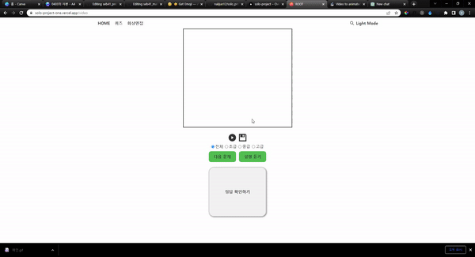
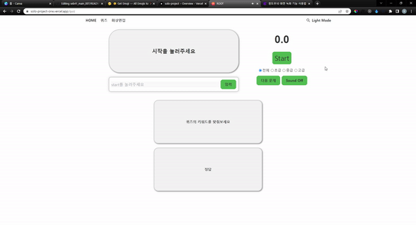
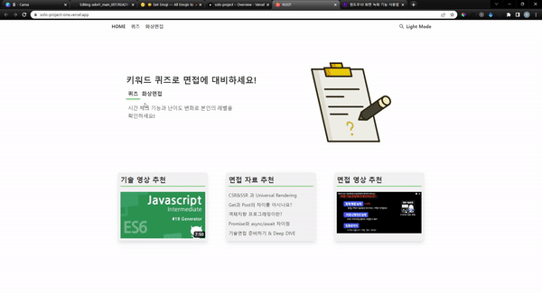
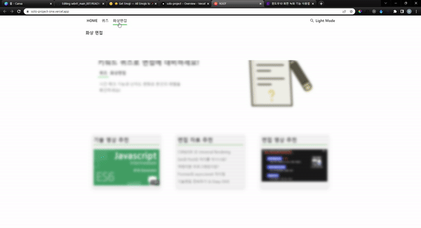
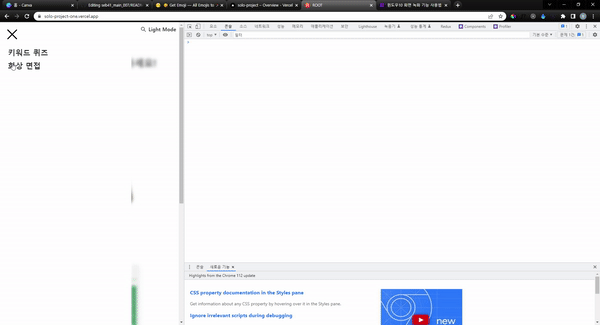
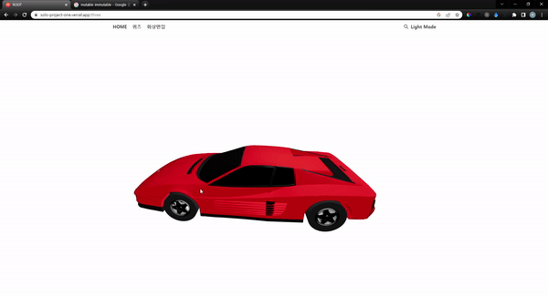

# **🌲 Root 🌲**

### **✅ 프로젝트 개요**

이전에 타 사이트에서는 기술면접 서비스가 있었지만 종료하였습니다.

그래서 자체적으로 영상을 찍고 저장하는 사이트가 필요하다고 느껴서 만들었습니다.

제 3 자가 물어 봐주었으면 좋겠다고 생각해서 읽기 기능과 간단한 퀴즈를 넣었습니다.

배포 링크 : https://solo-project-one.vercel.app/

 

- 메인 페이지, 퀴즈, 화상면접 페이지 작성
- Video 태그를 활용하여 영상촬영 및 녹화기능 구현
- Web Speech API 활용하여 문제 읽기 기능 구현
- PageTransition, MainCarousel, DropDown show/hide 애니메이션 구현
- 키워드 문제 알고리즘 구현

## **✨Feature✨**

 영상 녹화 & 문제 읽어주는 기능 

 퀴즈 

 메인화면 애니메이션 

 DropDown & PageTransition 애니메이션  

 Mobile 화면 

 Three.js 애니메이션 

주제와 상관없지만 아쉬워서 넣었습니다!
https://solo-project-one.vercel.app/three
기본 주소에 /three 추가하시면 볼 수 있습니다!

 

## **🛠️ 기술 스택**

